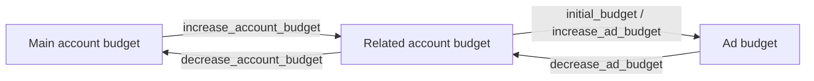

# Budgets and accounts

Money moves in two directions: between the **account** and its **ads**, and between a **main account** and its **related accounts**.



All amounts are in the account's [currency](concepts.md#4-currencies).

## Balances

```python
account = client.get_current_account()
account.remaining_budget     # free to spend: fund ads or related accounts
account.ads_budget           # already sitting in ads' own budgets
account.spent_budget         # spent so far
```

Each ad has its own `remaining_budget`, `spent_budget` and, when a daily limit is set, `daily_spent_budget` and `daily_budget_limit`.

## Ad budgets

```python
ad = client.create_ad(..., initial_budget=50)       # funded at creation

client.increase_ad_budget(ad.ad_id, 25)             # top up — returns the Ad
client.decrease_ad_budget(ad.ad_id, 10)             # take back

client.edit_ad(ad.ad_id, daily_budget_limit=15)     # at most 15 a day; 0 removes the cap
```

* Increasing needs enough money in the account budget.
* Decreasing needs enough in the ad's budget, and the ad must have been **inactive for at least 10 minutes**.
* Both carry an [idempotency key](concepts.md#6-idempotency) automatically.

## Related accounts

An agency's main account can create accounts for its clients, fund them from its own budget, and manage them with the same token.

### Create

```python
info = client.create_account(
    "Acme Corp",
    full_name="Acme Corporation Ltd.",
    email="ads@acme.example",
    phone_number="+15550100",
    country="United States",
    city="New York",
    legal_name="Acme Corporation Ltd.",     # optional; enables additional_info on ads
)
acme = client.with_account(info.account_id)
```

Only the main account can create related accounts, and only it can manage them. Company details can be changed later with `edit_account_info`, and read with `get_account_info`.

### List

```python
for account in client.iter_related_accounts():
    print(account.account_id, account.title, account.remaining_budget)

client.get_accounts_by_id(["rel-1", "rel-2"])
```

### Move money

```python
status = client.increase_account_budget("rel-123", 100)    # main → related
status = client.decrease_account_budget("rel-123", 40)     # related → main
```

Both return a [`TransactionStatus`](models.md#transactionstatus). A transfer can still be `in_progress` when the call returns; wait for it:

```python
final = client.wait_for_transaction(status)          # polls getTransactionStatus
if final.is_failed:
    print(final.error)                               # e.g. NOT_ENOUGH_BUDGET
```

`wait_for_transaction(..., timeout=60, interval=2)` raises `TimeoutError` if the transfer is still running after `timeout` seconds; you can look it up later with `get_transaction_status(transaction_id)`.

!!! tip "Use your own idempotency key for money you account for"
    The automatic key protects one call's retries. If your *program* may run the same top-up twice — a job restarted after a crash — pass a key derived from your own records, so the second run replays the first result instead of paying again:

    ```python
    client.increase_account_budget("rel-123", 100, idempotency_key=f"topup-{invoice_id}")
    ```

    Keys are kept for 24 hours.

## Transactions

Every movement of money is a transaction:

```python
for tx in client.iter_account_transactions():
    print(tx.when, tx.amount, type(tx.peer).__name__)

for tx in client.iter_ad_transactions(ad_id):
    ...
```

`peer` says where the money came from or went. For an account:

| Peer | `type` | Carries |
|---|---|---|
| `AccountTransactionPeerExternal` | `external` | `comment` — an invoice number, for example |
| `AccountTransactionPeerMainAccount` | `main_account` | — |
| `AccountTransactionPeerRelatedAccount` | `related_account` | `account_id`, `account_title` |
| `AccountTransactionPeerAd` | `ad` | `ad_id`, `ad_title`, `ad_is_deleted` |

For an ad:

| Peer | `type` | Carries |
|---|---|---|
| `AdTransactionPeerAccount` | `account` | — |
| `AdTransactionPeerViews` | `views` | `views` — paid views |

A negative `amount` is money leaving the budget you listed. A peer type added to the API later arrives as `UnknownObject`, with its `type` and `raw`.
